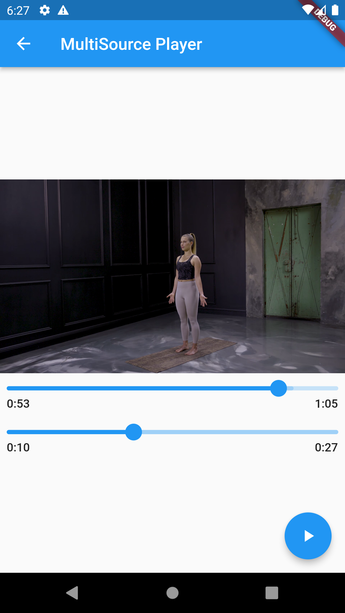

# Multi Source Player

This flutter demonstrations shows how to play a video in flutter with a different audio source without having to encode or bake a new video every time.

    

## Used packages:

- [video_player](https://pub.dev/packages/video_player)
- [audio_video_progress_bar](https://pub.dev/packages/audio_video_progress_bar)
- [just_audio](https://pub.dev/packages/just_audio)

**Note:** This is not intended for production use, especially the part about keeping the video and audio in sync.
